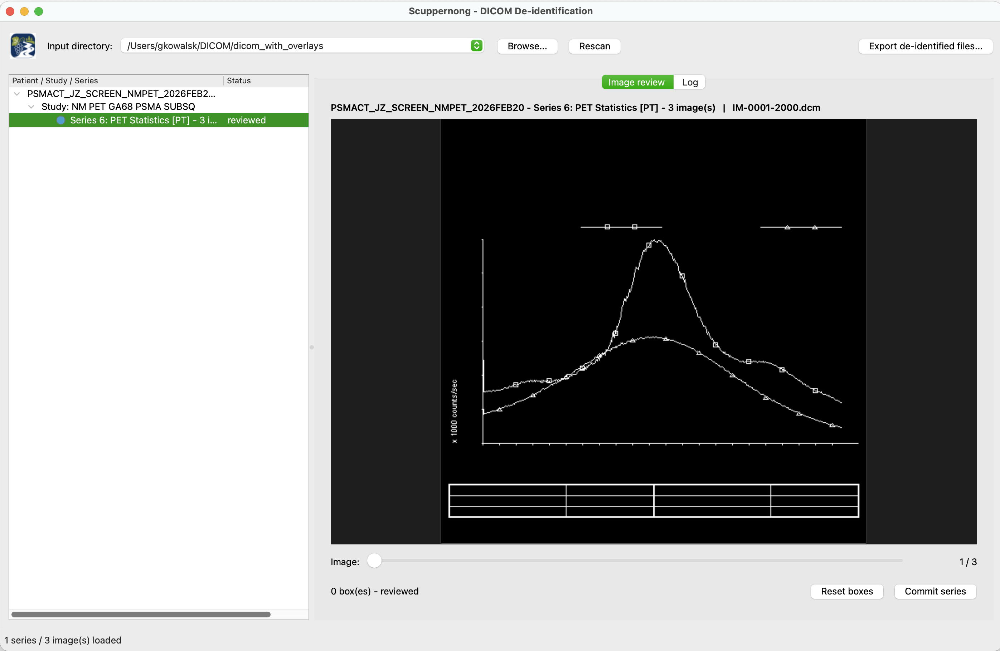

# Scuppernong


Named after the [Scuppernong River](https://en.wikipedia.org/wiki/Scuppernong_River_(Wisconsin)) in Wisconsin.

A DICOM De-identification tool for de-identifying burned-in annotations in DICOM images. You draw
boxes on one image of a series, the boxes apply to every image in that series, and then 
  export those files to an output directory with the same structure.

## Running

The project uses [uv](https://docs.astral.sh/uv/):

```bash
uv sync
uv run python main.py
```

All dependencies publish wheels for CPython 3.11–3.14. If a wheel is ever missing for
your interpreter, pin the venv to an older Python and re-sync:

```bash
uv venv --python 3.12 && uv sync
```
## UI Screenshot 



## Layout

| File | Purpose |
| --- | --- |
| `main.py` | Entry point; installs the logging bridge and a global exception hook |
| `deid_app/resources.py` | Bundled images — the toolbar logo and window icon |
| `images/` | `Scuppernong_logo_512x512.png`, shown top-left and used as the window icon |
| `deid_app/logging_setup.py` | Root logging config: `~/de-id.log` (rotating) + Qt signal bridge |
| `deid_app/log_pane.py` | Log tab: level filter, colouring, auto-scroll, clear button |
| `deid_app/metadata_pane.py` | Metadata tab: read-only DICOM tag tree for the displayed instance |
| `deid_app/model.py` | Recursive `*.dcm` scan (worker thread) and the `Series` model |
| `deid_app/render.py` | DICOM instance → `QImage` (modality LUT, VOI LUT, MONOCHROME1 inversion); `has_pixel_data()` detects pixel-free instances |
| `deid_app/sr_render.py` | Detects Structured Report–family instances and renders their `ContentSequence` as read-only HTML |
| `deid_app/image_view.py` | Image canvas and rubber-band box selection |
| `deid_app/frame_worker.py` | Frame rendering off the GUI thread: the render worker the display waits on, and the prefetch worker that renders ahead of the scroll |
| `deid_app/decode_cache.py` | The two thread-safe LRU caches those workers share — decoded datasets, and rendered frames bounded by count *and* bytes |
| `deid_app/redaction.py` | The de-identification itself — pixel data and overlays |
| `deid_app/export.py` | Export worker: mirrors the input tree into the output tree |
| `deid_app/main_window.py` | Window assembly, tree, tabs, wiring |
| `tests/` | Fixture generator, five headless GUI scripts, and two pytest-style unit modules |

## Workflow

1. **Pick an input directory** from the drop-down at the top (it remembers recent
   directories) or via **Browse…**. Nothing happens until you do.
2. The tree fills with `Patient → Study → Series`. Only **series** nodes are selectable;
   patient and study nodes are display-only.
3. Selecting a series renders its first image in the **Image review** tab. A modal
   **Loading series** popup covers the wait — it counts through the instance headers, then
   shows an indeterminate bar while the first image is decoded, and closes as soon as that
   image (or its placeholder) is on screen. A series that loads in under 300 ms never
   shows it. The slider at the bottom cycles through every image in the series
   (multi-frame instances contribute one slider position per frame). **Scrolling the mouse
   wheel** does the same thing, over the image *and* over the slider — wheel up moves
   toward the start of the series, wheel down toward the end, and it stops at either end
   rather than wrapping. Trackpad deltas accumulate, so one notch-equivalent of scrolling
   advances exactly one image. The wheel is ignored while you are mid-drag on a redaction
   box.
4. The **Metadata** tab shows the DICOM tags of whichever instance is on screen —
   *Field Name / Tag / VR / Size / Content*, with the `(0002,xxxx)` file meta group
   in grey (toggle it off with the **File meta** checkbox). Sequences expand into
   `Item n` sub-trees, multi-valued elements expand into one `value` row each, and
   binary elements (pixel data, overlays) show their size instead of their bytes.
   The **Filter** box narrows the tree to rows whose name, tag or content match.
   Building that tree is expensive, so it is rebuilt once the scrolling settles rather
   than for every image you pass — switching to the tab builds it immediately.
   It is read-only: nothing here is edited or exported. Note this app redacts pixels
   and overlays only — the tags shown are **not** de-identified on export.
5. **Drag on the image** to place a redaction box. While dragging, releasing inside the
   image keeps the box; dragging outside the image turns the selection **red** and
   releasing there discards it.
6. Selecting a series **automatically marks it "reviewed"** — the assumption is that you
   looked at the images. Placing a box moves it to **pending** (red), and **Commit series**
   moves it to **committed** (green). **⌘S** (Ctrl+S off macOS) commits the series being
   reviewed without reaching for the button — it works from any tab, is a no-op with a
   status-bar note if nothing is selected or the series is already committed, and the
   status bar confirms each commit.
7. **Reset boxes** drops every box on the series; it falls back to *reviewed*, since you
   have still seen the images. Adding a new box to a committed series re-opens it as
   pending.
8. **Right-click a series** for a popup menu: *Set status to Clean* (clears reviewed and
   committed, and discards any boxes after a confirmation), *Commit series*, *Reset boxes*.
   Setting the currently displayed series to Clean also deselects it, so clicking it again
   re-marks it reviewed.
9. **Export** requires every series to be **reviewed or committed**. A series carrying
   uncommitted boxes (*pending*) blocks the export until you commit it; a *clean* series
   blocks it until you look at it. Export then prompts for an output directory and writes
   each file to the same relative path underneath it.

### Non-pixel-data DICOM files

Not every DICOM instance carries pixel data, and the **Image review** tab handles both
cases it might encounter instead of crashing:

- **Structured Reports** (Basic Text/Enhanced/Comprehensive/Comprehensive 3D/Extensible
  SR, Key Object Selection, CAD SR variants, radiation-dose SR variants, and related
  report-only SOP Classes — the full list lives in `deid_app/sr_render.py`) have no
  pixel data at all; their content is a nested `ContentSequence` of text/code/numeric
  items. These render as a **read-only HTML report** in the image pane in place of the
  canvas — there is nothing to drag a redaction box onto, and the report cannot be
  edited.
- **Any other pixel-data-free instance** — Encapsulated PDF/CDA/STL, Presentation States
  (GSPS/CSPS), Waveform Storage, RT Structure Set/Plan, Registration objects, Real World
  Value Mapping, etc. — shows a placeholder instead of the missing image:
  `Uneditable Image : No Pixel Data for image {filename} of image type {SOP Class name}`.
  This is expected and logged at info level, not treated as an error.

Series containing these instances still go through the normal review/commit workflow
(status colors, export) even though there is nothing to redact on that particular
instance.

### Scrolling performance

Decoding a DICOM frame is far too slow to do while someone scrolls, so nothing that
touches pixel data happens on the GUI thread:

- **Two worker threads.** One renders the frame the display is waiting on; the other
  renders frames *ahead of* the scroll (6 positions in the direction of travel, 2 behind).
  Both run the same render path, so a prefetched frame is exactly what the display would
  otherwise have waited for.
- **Two caches**, shared by both workers: decoded datasets, and finished frames keyed by
  `(file, frame)`. A frame that is already rendered — revisited, or fetched ahead — is
  painted immediately with no worker round-trip at all. The frame cache is bounded by
  entry count and by total bytes (counting the dataset each entry keeps alive), so a
  series of large radiographs cannot grow it without limit.
- **Stale work is dropped, not decoded.** Prefetch requests from an abandoned series, or
  for positions a fast scrub has already passed, are discarded when the worker reaches
  them; and a slow render that finishes after you have moved on never paints over the
  image you are actually looking at.
- The **Metadata** tab and the scaled on-screen pixmap are both rebuilt only when they
  actually change, keeping per-image work on the GUI thread down to the paint itself.

Per-frame timings (dataset read, render, metadata build, display) are logged at **debug**
level — set the Log tab's level filter to `DEBUG` to see where the time goes.

### Series status

| Indicator | Status | Meaning | Export? |
| --- | --- | --- | --- |
| Grey | `clean` | never selected, or reset via the right-click menu | blocked |
| Blue | `reviewed` | you selected the series and saw the images | allowed |
| Red | `pending` | boxes placed but not committed | blocked |
| Green | `committed` | boxes locked in | allowed |

Everything — selections, commits, per-file results, and exceptions — is logged to the
**Log** tab and to `~/de-id.log`.

## How the redaction works

For every file in a series with boxes:

- **`(7FE0,0010)` Pixel Data** — decoded to an array, and each box region set to the
  value that renders black (0, or the max stored value for `MONOCHROME1`). Applied to
  every frame of multi-frame instances.
- **`(60xx,3000)` Overlay Data** — every overlay group in `6000`–`601E` is unpacked
  bit-by-bit, the box regions are zeroed, and the plane is repacked. Box coordinates are
  mapped onto the overlay grid using `(60xx,0050)` Overlay Origin, so overlays smaller
  than the image or offset from it are handled correctly. Multi-frame overlays
  (`(60xx,0015)`) are handled too. Overlays are redacted even though only `(7FE0,0010)` is
  shown in the UI.
- **Compressed input (JPEG etc.)** — the frame cannot be edited in place, so the file is
  decoded and rewritten as Explicit VR Little Endian. `YBR_*` data is normalised to `RGB`
  (so that 0,0,0 really is black) and `PhotometricInterpretation` / `PlanarConfiguration`
  are updated to match. This is logged per file.
- `(0028,0301) BurnedInAnnotation` is set to `NO` on redacted files.

Series with no boxes are copied through byte-for-byte.

Boxes are stored as fractions of the image (0–1), not screen pixels, so they are immune
to window resizing and to instances within a series having different dimensions.

**Scope note:** this tool redacts *pixels and overlays*. It does not scrub identifying
DICOM metadata (patient name, IDs, dates, UIDs, private tags) — pair it with a tag-level
de-identification step if you need PS3.15 Annex E conformance.

## Tests

```bash
uv run python tests/make_fixtures.py /tmp/fixtures   # synthetic mono / RGB multiframe / JPEG + overlays
uv run python tests/test_redaction.py                # verifies pixels + overlay bits are zeroed
QT_QPA_PLATFORM=offscreen uv run python tests/test_gui_smoke.py
QT_QPA_PLATFORM=offscreen uv run python tests/test_metadata_pane.py
QT_QPA_PLATFORM=offscreen uv run python tests/test_commit_shortcut.py
uv run python tests/test_overlay_display.py
```

Each of those is a standalone script that prints `PASS`/`FAIL` per check and exits
non-zero on failure. `tests/test_render.py` and `tests/test_sr_render.py` are plain
pytest-style modules of unit tests instead.

## Credits
- Developed by the **CTSI of SE WI**
- If you utilize CTSI resources, please cite the **NIH CTSA; 2UL1TR001436, 2TL1TR001437, 2KL2TR001438** and acknowledge support.
